<a id="readme-top"></a>

<!-- PROJECT SHIELDS -->

[![Contributors][contributors-shield]][contributors-url]
[![Forks][forks-shield]][forks-url]
[![Stargazers][stars-shield]][stars-url]
[![Issues][issues-shield]][issues-url]
[![MIT License][license-shield]][license-url]
[![LinkedIn][linkedin-shield]][linkedin-url]

<!-- PROJECT LOGO -->

<br />

<div align="center">
  <a href="https://github.com/fathulfahmy/the-barter-app-backend">
    
  </a>

  <h3 align="center">The Barter App</h3>

  <p align="center">
    A platform where users can exchange services for other services, cash, or both.
    <br />
    <br />
    <a href="https://github.com/fathulfahmy/the-barter-app-backend/issues/new?labels=bug&template=bug-report---.md">Report Bug</a>
    &middot;
    <a href="https://github.com/fathulfahmy/the-barter-app-backend/issues/new?labels=enhancement&template=feature-request---.md">Request Feature</a>
  </p>
</div>

<!-- TABLE OF CONTENTS -->

## Table of Contents

<ol>
  <li>
    <a href="#about-the-project">About The Project</a>
    <ul>
      <li><a href="#built-with">Built With</a></li>
    </ul>
  </li>
  <li>
    <a href="#getting-started">Getting Started</a>
    <ul>
      <li><a href="#prerequisites">Prerequisites</a></li>
      <li><a href="#installation">Installation</a></li>
    </ul>
  </li>
  <li><a href="#demo">Demo</a></li>
  <li><a href="#contributing">Contributing</a></li>
  <li><a href="#license">License</a></li>
  <li><a href="#contact">Contact</a></li>
  <li><a href="#acknowledgments">Acknowledgments</a></li>
</ol>

<!-- ABOUT THE PROJECT -->

## About The Project

![product-screenshot]

The Barter App is a platform where users can exchange services for other services, cash, or both. Features include service search and request, in-app messaging, payment processing, statistical graphs, fraud and scam report, account suspension, user and data management admin panel. Built with React Native for user mobile application, Laravel for admin website, API documentation website, and REST API.

<p align="right">(<a href="#readme-top">back to top</a>)</p>

### Built With

-   ![laravel-badge]
-   ![react-native-badge]

<p align="right">(<a href="#readme-top">back to top</a>)</p>

<!-- GETTING STARTED -->

## Getting Started

### Prerequisites

-   PHP
-   Composer
-   XAMPP
-   Node.js
-   NPM
-   Visual Studio Code

### Installation

#### Backend (Laravel)

1. Clone the repository
    ```sh
    git clone https://github.com/fathulfahmy/the-barter-app-backend.git
    ```
2. Navigate to project directory
    ```sh
    cd the-barter-app-backend
    ```
3. Change git remote url
    ```sh
    git remote set-url origin fathulfahmy/the-barter-app-backend
    git remote -v # confirm the changes
    ```
4. Install dependencies
    ```sh
    composer install
    ```
5. Set up environment variables
    ```sh
    cp .env.example .env
    ```
6. Migrate and seed database
    ```sh
    php artisan migrate --seed
    ```
7. Start server
    ```sh
    php artisan serve
    ```

#### Frontend (React Native)

1. Clone the repository
    ```sh
    git clone https://github.com/fathulfahmy/the-barter-app.git
    ```
2. Navigate to project directory
    ```sh
    cd the-barter-app
    ```
3. Change git remote url
    ```sh
    git remote set-url origin fathulfahmy/the-barter-app
    git remote -v # confirm the changes
    ```
4. Install dependencies
    ```sh
    npm install
    ```
5. Set up environment variables
    ```sh
    cp .env.example .env.local
    ```
6. Run on Expo
    ```sh
    expo start
    ```

<p align="right">(<a href="#readme-top">back to top</a>)</p>

<!-- DEMO EXAMPLES -->

## Demo

<table>
   <tr>
      <td>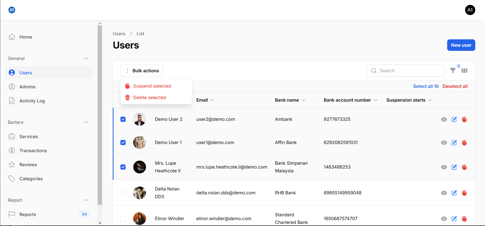</td>
      <td>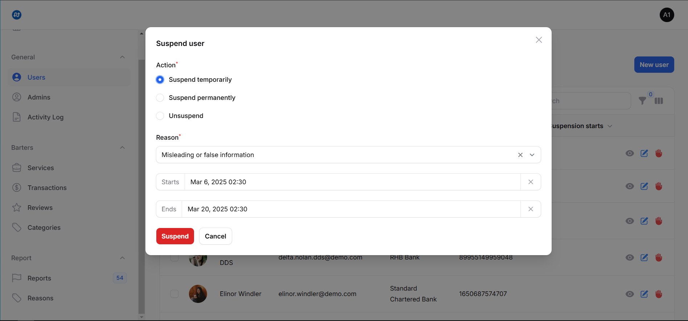</td>
   </tr>
   <tr>
      <td>Users</td>
      <td>Suspension</td>
   </tr>
   <tr>
      <td>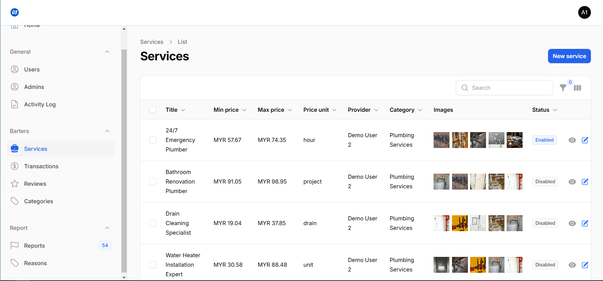</td>
      <td>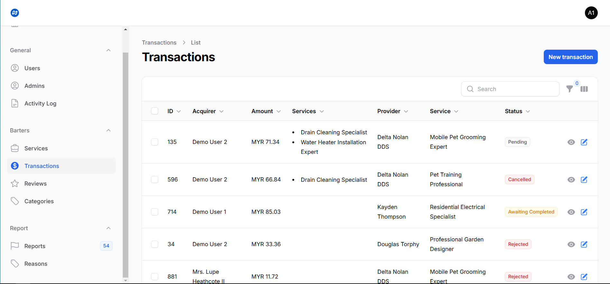</td>
   </tr>
   <tr>
      <td>Services</td>
      <td>Transactions</td>
   </tr>
   <tr>
      <td></td>
      <td>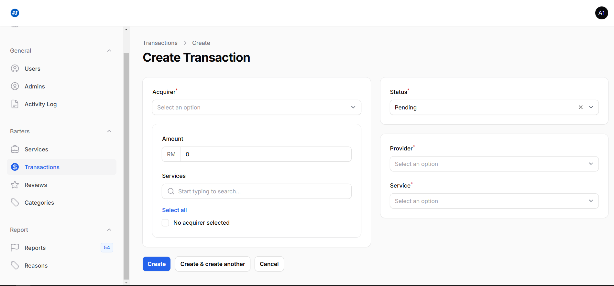</td>
   </tr>
   <tr>
      <td>Edit Form</td>
      <td>Create Form</td>
   </tr>
   <tr>
      <td>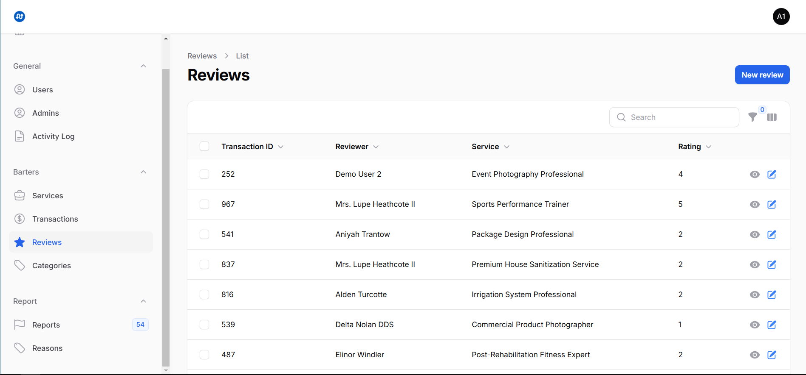</td>
      <td>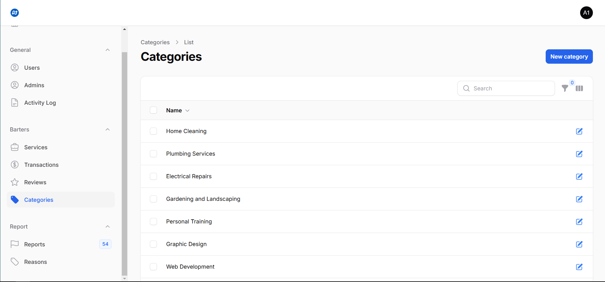</td>
   </tr>
   <tr>
      <td>Reviews</td>
      <td>Categories</td>
   </tr>
   <tr>
      <td></td>
      <td>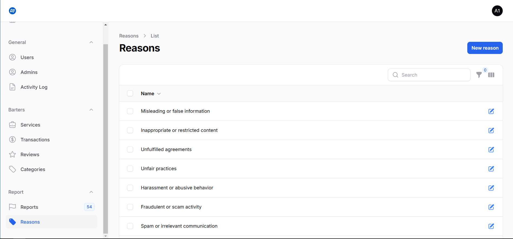</td>
   </tr>
   <tr>
      <td>Reports</td>
      <td>Reasons</td>
   </tr>
   <tr>
      <td>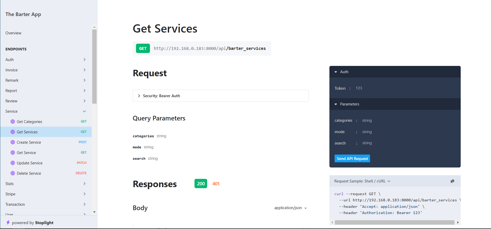</td>
      <td>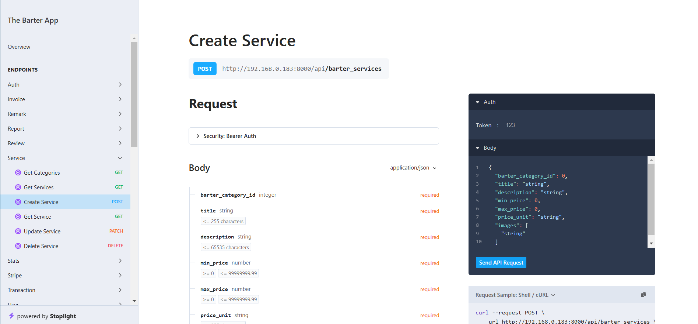</td>
   </tr>
   <tr>
      <td>API GET</td>
      <td>API CREATE</td>
   </tr>
   <tr>
      <td>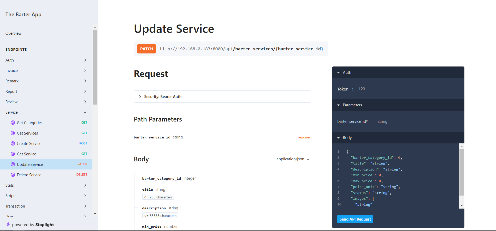</td>
      <td>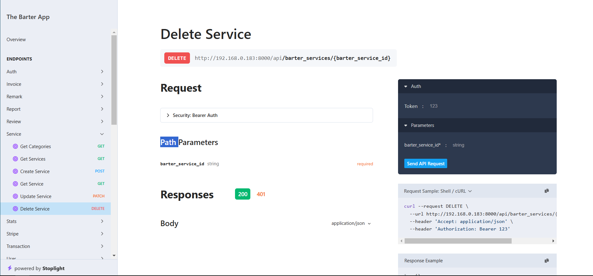</td>
   </tr>
   <tr>
      <td>API UPDATE</td>
      <td>API DELETE</td>
   </tr>
</table>

<p align="right">(<a href="#readme-top">back to top</a>)</p>

<!-- CONTRIBUTING -->

## Contributing

Contributions are what make the open source community such an amazing place to learn, inspire, and create. Any contributions you make are **greatly appreciated**.

If you have a suggestion that would make this better, please fork the repo and create a pull request. You can also simply open an issue with the tag "enhancement".
Don't forget to give the project a star! Thanks again!

1. Fork the Project
2. Create your Feature Branch (`git checkout -b feature/amazing-feature`)
3. Commit your Changes (`git commit -m 'feat: add amazing feature'`)
4. Push to the Branch (`git push origin feature/amazing-feature`)
5. Open a Pull Request

### Top contributors

<a href="https://github.com/fathulfahmy/the-barter-app-backend/graphs/contributors">
  
</a>

<p align="right">(<a href="#readme-top">back to top</a>)</p>

<!-- LICENSE -->

## License

Distributed under the MIT License. See `LICENSE.md` for more information.

<p align="right">(<a href="#readme-top">back to top</a>)</p>

<!-- CONTACT -->

## Contact

Fathul Fahmy - [@fathulfahmy](https://linkedin.com/in/fathulfahmy) - mfathulfahmy@gmail.com

Project Link (Backend): https://github.com/fathulfahmy/the-barter-app-backend  
Project Link (Frontend): https://github.com/fathulfahmy/the-barter-app

<p align="right">(<a href="#readme-top">back to top</a>)</p>

<!-- ACKNOWLEDGMENTS -->

## Acknowledgments

-   [filament](https://filamentphp.com/)
-   [scramble](https://scramble.dedoc.co/)
-   [stream-chat-php](https://github.com/GetStream/stream-chat-php)
-   [Best-README-Template](https://github.com/othneildrew/Best-README-Template)

<p align="right">(<a href="#readme-top">back to top</a>)</p>

<!-- MARKDOWN LINKS & IMAGES -->
<!-- https://www.markdownguide.org/basic-syntax/#reference-style-links -->

[contributors-shield]: https://img.shields.io/github/contributors/fathulfahmy/the-barter-app-backend.svg?style=for-the-badge
[contributors-url]: https://github.com/fathulfahmy/the-barter-app-backend/graphs/contributors
[forks-shield]: https://img.shields.io/github/forks/fathulfahmy/the-barter-app-backend.svg?style=for-the-badge
[forks-url]: https://github.com/fathulfahmy/the-barter-app-backend/network/members
[stars-shield]: https://img.shields.io/github/stars/fathulfahmy/the-barter-app-backend.svg?style=for-the-badge
[stars-url]: https://github.com/fathulfahmy/the-barter-app-backend/stargazers
[issues-shield]: https://img.shields.io/github/issues/fathulfahmy/the-barter-app-backend.svg?style=for-the-badge
[issues-url]: https://github.com/fathulfahmy/the-barter-app-backend/issues
[license-shield]: https://img.shields.io/github/license/fathulfahmy/the-barter-app-backend.svg?style=for-the-badge
[license-url]: https://github.com/fathulfahmy/the-barter-app-backend/blob/main/LICENSE.md
[linkedin-shield]: https://img.shields.io/badge/-LinkedIn-black.svg?style=for-the-badge&logo=linkedin&colorB=555
[linkedin-url]: https://linkedin.com/in/fathulfahmy
[product-screenshot]: docs/banner.png
[laravel-badge]: https://img.shields.io/badge/Laravel-FF2D20?logo=laravel&logoColor=white&style=for-the-badge
[react-native-badge]: https://img.shields.io/badge/React_Native-61DAFB?logo=react&logoColor=black&style=for-the-badge
